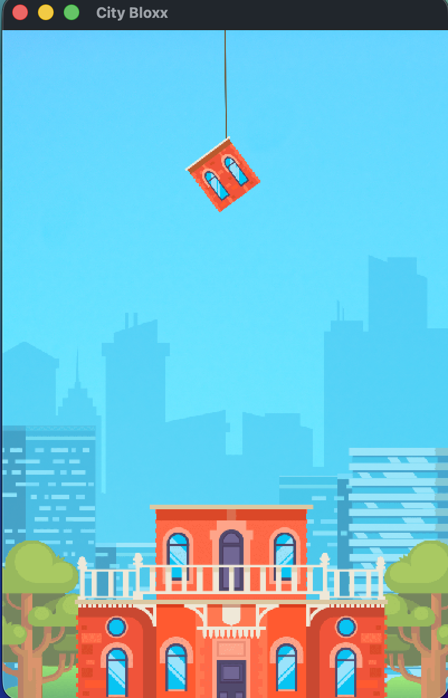
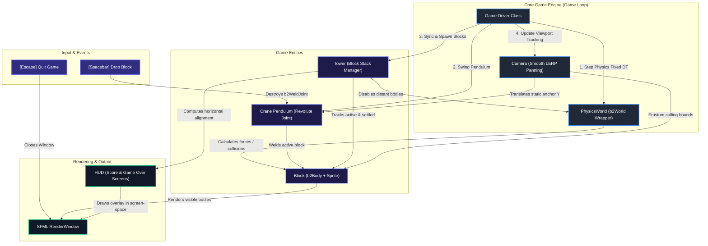

# 🏙️ City Bloxx (Physics Tower Builder)

A physics-based 2D tower building game written in modern C++20 using the **SFML** graphics library and **Box2D** physics engine. Challenge your reflexes and timing to stack building blocks as high as you can while fighting swinging pendulum physics, gravity, and structural instability!

---

## 🎮 Gameplay Preview

<p align="center">
  
</p>

---

## 🛠️ Technology Stack

The project leverages a robust and lightweight C++ game development ecosystem:M

*   **Language**: C++20 standard.
*   **Graphics & Windowing**: [SFML (Simple and Fast Multimedia Library) 2.6.2](https://www.sfml-dev.org/) — manages the application window, handles keyboard input, renders textures, and displays text in screen space.
*   **Physics Simulation**: [Box2D 2.4.2](https://box2d.org/) — drives all the structural collisions, pendulum swinging mechanics, mass density, friction coefficients, and toppling gravity.
*   **Dependency Management**: [Conan 2.x](https://conan.io/) — automatically manages and resolves dependencies for SFML, Box2D, and their transitive requirements in a cross-platform manner.
*   **Build Pipeline**: [CMake 3.28+](https://cmake.org/) — configures the compilation targets and automates binary asset compilation.
*   **Platform Integration**:
    *   **macOS**: Automatic ad-hoc code-signing post-build to seamlessly bypass Gatekeeper warnings.
    *   **Windows**: Custom compilation of `.rc` resource scripts to embed application icons generated on the fly from texture resources.

---

## 🏗️ Core Architecture

The game is designed with a highly modular, decoupled architecture, separating physics simulation, input processing, camera systems, and entity management. The diagram below illustrates how these components interact within the dynamic game loop:



---

## ⚙️ Game Mechanics & Algorithms

### 📊 Satisfying Score & Alignment System
The score for each successfully dropped block is computed based on how precisely it aligns horizontally with the block immediately beneath it.

$$Score = (1 - offset^2) \times 100$$

Where $offset$ is calculated as:

$$offset = \frac{|\Delta X|}{\text{Block Width}}$$

*   **Perfect Placement Bonus**: If the offset is under $5\%$ ($< 2.5$ pixels), the player is rewarded with a perfect score of flat $100$.
*   **Quadratic Penalty**: The score drops quadratically as offset increases. If the offset is $1.0$ or higher (a complete miss), the block scores $0$ points and will likely fall off the tower, leading to a Game Over.

### ❄️ Distant Body Freezing (CPU Optimisation)
As the tower grows higher, the physics simulation could quickly become a CPU bottleneck due to continuous collision checks between dozens of stacked blocks. To maintain a smooth 60 FPS, City Bloxx implements an automated freezing routine:
*   Once the tower exceeds 10 blocks, any blocks residing lower than $800$ pixels below the camera's upper margin are frozen using `m_body->SetEnabled(false)`.
*   This temporarily removes them from Box2D collision sweeps while preserving their final visual positions on screen, ensuring near-constant CPU performance regardless of tower height.

---

## ⚡ Binary Asset Embedding

To prevent file loading errors and ensure a single standalone executable, the project compiles raw game assets directly into the C++ binary:
1.  A custom Python script `cmake/bin2c.py` takes raw textures (`.png`, `.jpg`) and fonts (`.ttf`) and converts them into memory-aligned C++ source files containing `const unsigned char` byte arrays.
2.  CMake automatically builds these source files and links them to the executable.
3.  The game loads files at runtime directly from memory using SFML's memory loading APIs:
    ```cpp
    m_blockTexture.loadFromMemory(ASSET_BLOCK_PNG, ASSET_BLOCK_PNG_SIZE);
    ```

---

## 🚀 Building and Running the Game

### Prerequisites
Make sure your system has the following installed:
*   **CMake** (>= 3.28)
*   **Python 3.x**
*   **Conan** (2.x)
*   A C++20 compliant compiler (GCC 11+, Clang 13+, or MSVC 2022+)

### How to Build & Run
To compile and launch the game, run the provided automated build script from the repository root. This script automatically handles dependency installation via Conan, CMake configuration, building the target executable, and launching the game:

```bash
chmod +x build.sh
./build.sh
```

> [!NOTE]
> On Windows, you can execute the build script inside a Bash-compatible shell (e.g., Git Bash or MSYS2), or run the same commands inside your terminal of choice.


---

## ⌨️ Controls

*   `Spacebar` — Releases the current block from the swinging crane hook.
*   `Escape` — Exits the application immediately.
