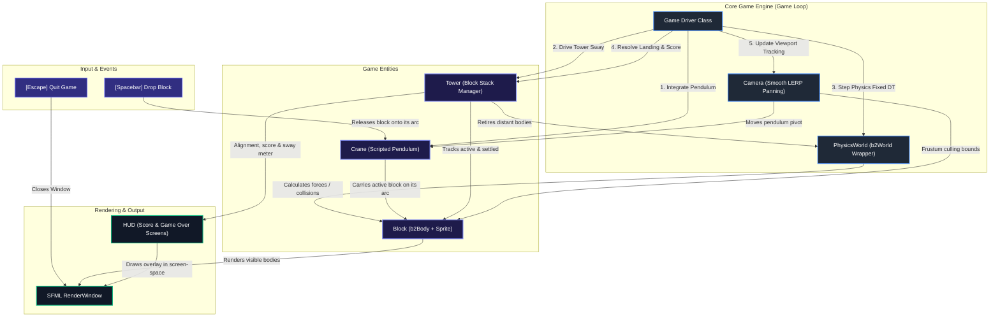

## City Bloxx (Physics Tower Builder)

A physics-based 2D tower building game written in modern C++20 using the **SFML** graphics library and **Box2D** physics engine. Challenge your reflexes and timing to stack building blocks as high as you can while fighting swinging pendulum physics, gravity, and structural instability!

---

## 🎮 Gameplay Preview

<p align="center">
  
</p>

---

## 🛠️ Technology Stack

The project leverages a robust and lightweight C++ game development ecosystem:

*   **Language**: C++20 standard.
*   **Graphics & Windowing**: [SFML (Simple and Fast Multimedia Library) 2.6.2](https://www.sfml-dev.org/) — manages the application window, handles keyboard input, renders textures, and displays text in screen space.
*   **Physics Simulation**: [Box2D 2.4.2](https://box2d.org/) — drives the falling block, landing impacts, and the final collapse. The crane swing and the tower sway are scripted rather than solved, for motion that is smooth and tunable by design.
*   **Dependency Management**: [Conan 2.x](https://conan.io/) — automatically manages and resolves dependencies for SFML, Box2D, and their transitive requirements in a cross-platform manner.
*   **Build Pipeline**: [CMake 3.28+](https://cmake.org/) — configures the compilation targets and automates binary asset compilation.
*   **Platform Integration**:
    *   **macOS**: Automatic ad-hoc code-signing post-build to seamlessly bypass Gatekeeper warnings.
    *   **Windows**: Custom compilation of `.rc` resource scripts to embed application icons generated on the fly from texture resources.

---

## 🏗️ Core Architecture

The game is designed with a highly modular, decoupled architecture, separating physics simulation, input processing, camera systems, and entity management. The diagram below illustrates how these components interact within the dynamic game loop:



---

## ⚙️ Game Mechanics & Algorithms

### 🏗️ The crane is a scripted pendulum, not a jointed body
The crane deliberately uses **no Box2D bodies at all**. Driving it with a revolute
joint meant the solver fought every camera scroll and every hand-set velocity,
which is what made the old swing erratic. Instead the arm integrates the real
pendulum equation

$$\ddot{\theta} = -\frac{g}{L}\sin\theta$$

with a **symplectic (semi-implicit Euler) integrator** at a fixed timestep. That
integrator is energy-stable, so the swing neither decays nor winds itself up. A
light energy correction each step pins the amplitude exactly:

$$e = \tfrac{1}{2}L\omega^{2} + g\,(1 - \cos\theta)$$

The hook's pose *and its analytic velocity* are published, so the block riding
the rope sits exactly on the arc and is released with precisely the tangential
momentum it already had — the throw continues the arc instead of jumping.

While attached the block is a **kinematic** body that collides with nothing; on
release it becomes **dynamic with CCD** (`SetBullet`) so it can never tunnel
through the tower. Blocks tilt with the rope, as a rigid pendulum would.

### 🏢 The tower is a driven swaying column
Settled blocks are kinematic and are written every fixed step to

$$x(h) = x_{base}(h) + A\,h^{k}\sin(\phi)$$

where $h$ is a block's normalised height and $k$ bends the profile like a
cantilever — the top sways far, the base barely at all. Each block is also
tilted along the tangent of the bent column, so the building reads as one
flexing structure rather than a sliding pile. Taller buildings sway further and
more slowly, exactly as real ones do.

### 📊 Accuracy drives the sway (the core feedback loop)
The sway amplitude $A$ is driven by **how well you stack**. On each landing the
offset between the new block and the one below,
$offset = |\Delta x| / \text{blockWidth}$, updates an *instability* value:

*   **A near-perfect drop pays the building back**, visibly calming it down.
*   **A sloppy drop winds it up.** The response is curved, not linear
    ($\propto offset^{1.6}$), so a slightly-off drop barely registers while a
    genuinely bad one shakes the building — and no single mistake is fatal.
*   **At instability 1.0 the building goes over** and the run ends.

The `SWAY` meter in the HUD shows this value, because it is the thing the whole
game hangs on.

### 🧲 "Click upright" landings
When a block touches down it is snapped square against the block below by an
amount that falls off with the miss:

*   $offset = 0$ — snapped dead centre and perfectly level.
*   $offset \ge$ `STACK_SNAP_LIMIT` — left exactly where it landed, leaning the
    column and adding lasting drift.
*   $offset >$ `STACK_FAIL_OFFSET` — too little overlap to hold: the block misses
    and the building collapses.

Collapse is the one place full rigid-body physics takes over: every block turns
dynamic and the tower genuinely topples.

---

## 🚀 Building and Running the Game

### Prerequisites
Make sure your system has the following installed:
*   **CMake** (>= 3.28)
*   **Python 3.x**
*   **Conan** (2.x)
*   A C++20 compliant compiler (GCC 11+, Clang 13+, or MSVC 2022+)

### How to Build & Run
To compile and launch the game, run the provided automated build script from the repository root. This script automatically handles dependency installation via Conan, CMake configuration, building the target executable, and launching the game:

```bash
chmod +x build.sh
./build.sh
```

> [!NOTE]
> On Windows, you can execute the build script inside a Bash-compatible shell (e.g., Git Bash or MSYS2), or run the same commands inside your terminal of choice.


---

## ⌨️ Controls

*   `Spacebar` — Releases the current block from the swinging crane hook.
*   `Spacebar` / `R` / `Enter` — Rebuilds after a collapse.
*   `Escape` — Exits the application immediately.
